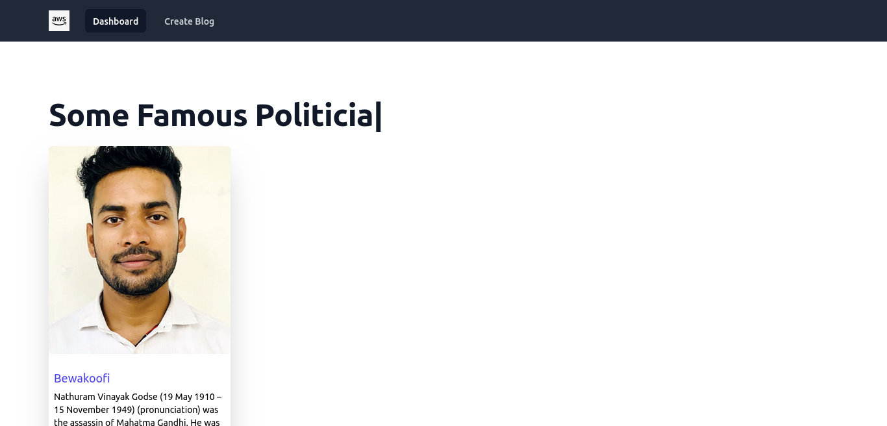
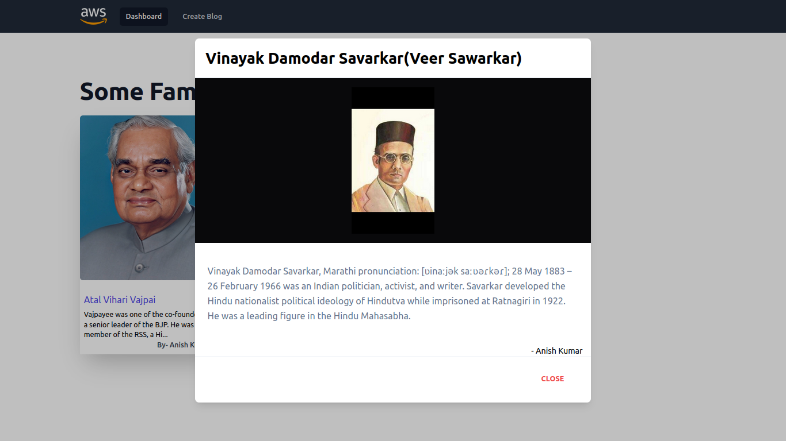
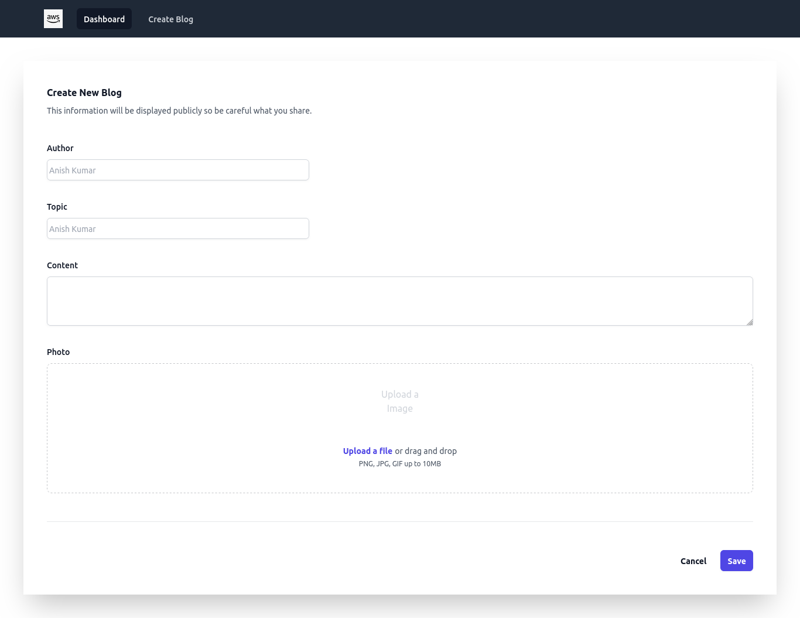

# Blog App with S3 Bucket

<h3 align="center">
  Blog Website Home page preview  
  
  Blog Website individual Model for more information 
   
  Blog Website Create Blog page preview  
  
</h3>

 
<h5>This is a web site where you can share your knowledge about famous personalities of india.</h5>

## Working Senario
   <h5> when someone is tring to create new blog/post by adding details on create blog page and clicking on submit buton media data will be stored in AWS S3(Simple Storage Service) bucket and other data along with image unique name will be saved in Mongodb Database and imidiatly the same data will reflect on home page </h5>

## 📖 Website's Live URL  
  https://blogappbyanish.onrender.com/  
  (or you can just click on above image will redirect you to the website)

# Blog_App_Frontend

## ⭐ Technologies that are used.

### FrontEnd
- #### React  
    This app is fully built on top of react library.
- #### Axios 
    Used for making api calls.
- #### Tailwind
    for css . 
- #### React-Toastify
    for showing Success alert on booking sucessfully  and error alert for any error to user.
    

## 🛠 Installation and Setup Instructions

1. Installation: `npm install`

2. In the project directory, you can run: `npm start`

Runs the app in the development mode.\
Open [http://localhost:3000](http://localhost:3000) to view it in the browser.
The page will reload if you make edits.

# Blog_App_Backend

## ⭐ Technologies that are used.
### Backend
-  Express
      - Backend is based on Express.Js
-  Mongoose
      - for MongoDB Connection
- AWS-SDK || @aws-sdk/client-s3
    for S3 Bucket client(S3Client) setup and other utilities (PutObjectCommand, GetObjectCommand).
- Multer
  for handling multipart/form-data.
- @aws-sdk/s3-request-presigner
    for signed url.
  - sharp, crypto etc.
  
### Endpoint
- GET - https://blogapps3.onrender.com/api/blogs
       - for geting the blogs from Database
- POST - https://blogapps3.onrender.com/api/blogs
       - for sending the blog's information to Database 

## 🛠 Installation and Setup Instructions

1. Installation: `npm install`

2. In the project directory, you can run: `node index.js`
(use Nodemon insted Node if you want that changes will reload if you make edits.
(before using nodemon please ensure that nodemon is installed in your system))

##
<h4 align="center">Made with ❤️ from Anish</h4>
<h4 align="center">Thank You</h4>

